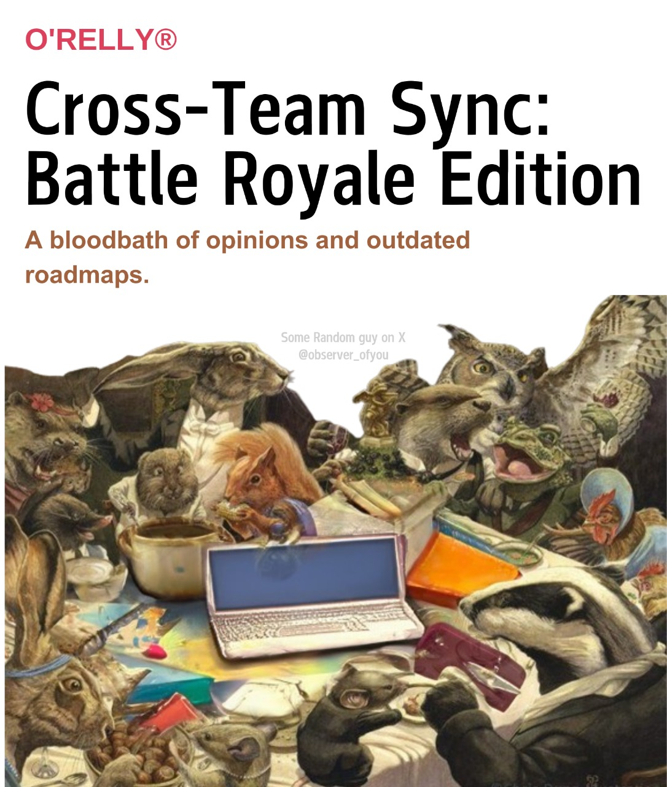

# Cross-Team Sync Battle Royale

## Synopsis

Cross-Team Sync: Battle Royale Edition, with the subtitle A bloodbath of opinions and outdated roadmaps. In the cutthroat jungle of modern tech enterprises, Cross-Team Sync: Battle Royale Edition offers a darkly comedic survival guide to the savage ritual known as the "team sync meeting." When product managers, developers, and designers are forced to share a single conference table (and a singular, perpetually outdated roadmap), chaos erupts with the ferocity of a pack of caffeinated squirrels fighting over the last acorn. Through biting wit and a menagerie of beleaguered woodland creatures — each representing a different department — author "Some Random Guy on X" (@observer_of_you) dissects the absurdities of corporate collaboration. Expect a masterclass in navigating passive-aggressive stand-ups, dodging Jira tickets thrown like daggers, and surviving the inevitable moment when someone suggests "just one more pivot" before the quarterly review. Perfect for anyone who’s ever dreamed of escaping a sprint retrospective with their sanity — or their dignity — intact.

## Table of Contents

* [Part 1: **The Gathering Storm:** Introduction of the teams, the outdated roadmap, and the impending doom of the cross-team sync](#part-1-The_Gathering_Storm____Introduction_of)
  * [Chapter 1.1: The Squirrel Summit: Assembling the Players](#chapter-1-1-The_Squirrel_Summit__Assembling_the_Play)
  * [Chapter 1.2: Roadmap Ragnarok: A Relic of a Bygone Quarter](#chapter-1-2-Roadmap_Ragnarok__A_Relic_of_a_Bygone_Qu)
  * [Chapter 1.3: Jira-ssic Park: The Ecosystem of Interdependence (and Resentment)](#chapter-1-3-Jira-ssic_Park__The_Ecosystem_of_Interde)
  * [Chapter 1.4: The Quiet Before the Storm: Last Stand-Up Before the Bloodbath](#chapter-1-4-The_Quiet_Before_the_Storm__Last_Stand-U)
* [Part 2: **The Bloodbath Begins:** The first half of the meeting devolves into passive-aggressive stand-ups, conflicting priorities, and Jira ticket warfare](#part-2-The_Bloodbath_Begins____The_first_half)
  * [Chapter 2.1: Stand-Up Standoff: The Passive-Aggression Olympics](#chapter-2-1-Stand-Up_Standoff__The_Passive-Aggressio)
  * [Chapter 2.2: Priority Pile-Up: When Every Fire is a Five-Alarm](#chapter-2-2-Priority_Pile-Up__When_Every_Fire_is_a_F)
  * [Chapter 2.3: Jira Javelin: Weaponizing the Workflow](#chapter-2-3-Jira_Javelin__Weaponizing_the_Workflow)
  * [Chapter 2.4: The Great Feature Freeze Debate: A Cold War in The Acorn](#chapter-2-4-The_Great_Feature_Freeze_Debate__A_Cold)
* [Part 3: **Mid-Meeting Mayhem:** A disastrous attempt at "alignment" leads to escalating arguments, blame-shifting, and the dreaded "one more pivot" suggestion](#part-3-Mid-Meeting_Mayhem____A_disastrous_att)
  * [Chapter 3.1: The Alignment Altar: Sacrificing Sanity for Synergy](#chapter-3-1-The_Alignment_Altar__Sacrificing_Sanity)
  * [Chapter 3.2: Blame Game Bonanza: Finger-Pointing Frenzy](#chapter-3-2-Blame_Game_Bonanza__Finger-Pointing_Fren)
  * [Chapter 3.3: Pivot Panic: The Quarterly Review Cliffhanger](#chapter-3-3-Pivot_Panic__The_Quarterly_Review_Cliffh)
  * [Chapter 3.4: The Roadmap Revolt: Uprising of the Unheard](#chapter-3-4-The_Roadmap_Revolt__Uprising_of_the_Unhe)
* [Part 4: **Survival Strategies:** Characters employ increasingly desperate (and darkly humorous) tactics to navigate the chaos and protect their sanity](#part-4-Survival_Strategies____Characters_empl)
  * [Chapter 4.1: The Coffee Clutch: Caffeine-Fueled Coalition](#chapter-4-1-The_Coffee_Clutch__Caffeine-Fueled_Coali)
  * [Chapter 4.2: The Silent Treatment Gambit: Withdrawing into Oneself](#chapter-4-2-The_Silent_Treatment_Gambit__Withdrawing)
  * [Chapter 4.3: Meeting Bingo: A Desperate Game of Distraction](#chapter-4-3-Meeting_Bingo__A_Desperate_Game_of_Distr)
  * [Chapter 4.4: The "Technical Difficulty" Escape Route: A Risky Maneuver](#chapter-4-4-The__Technical_Difficulty__Escape_Route)
* [Part 5: **The Aftermath:** The meeting concludes with a fragile truce, lingering resentment, and the realization that another battle awaits](#part-5-The_Aftermath____The_meeting_concludes)
  * [Chapter 5.1: The Truce of Tiredness: A Fragile Peace Treaty](#chapter-5-1-The_Truce_of_Tiredness__A_Fragile_Peace)
  * [Chapter 5.2: Residue of Resentment: The Lingering Aftertaste](#chapter-5-2-Residue_of_Resentment__The_Lingering_Aft)
  * [Chapter 5.3: The Post-Mortem of Morale: Assessing the Damage](#chapter-5-3-The_Post-Mortem_of_Morale__Assessing_the)
  * [Chapter 5.4: Another Acorn Awaits: The Cycle Continues](#chapter-5-4-Another_Acorn_Awaits__The_Cycle_Continue)

## Part 1: **The Gathering Storm:** Introduction of the teams, the outdated roadmap, and the impending doom of the cross-team sync

### Chapter 1.1: The Squirrel Summit: Assembling the Players

The Squirrel Summit: Assembling the Players

The conference room, affectionately nicknamed "The Acorn" due to its wood-paneled walls and history of nut-related snack spills, awaited its weekly sacrifice. Today's agenda: the Cross-Team Sync, a ritual as vital as it was volatile, a scheduled skirmish disguised as a collaborative meeting. The air crackled with the barely suppressed anticipation of impending doom.

**Team Chipmunk: The Product Visionaries (or Victims?)**

First to arrive, as always, were the Chipmunks, led by Penelope, the Product Manager. Penelope, a whirlwind of sticky notes and user stories, genuinely believed in the product, a naivete that bordered on endearing and, frankly, endangered. She clutched the sacred roadmap, a document so out-of-date it qualified for historical preservation, like a shield against the coming storm. Her team, a collection of analysts and junior PMs, nervously arranged their laptops, each subtly angling for a defensible position near the power outlets. They represented the 'Why?' of the product, a noble pursuit often lost in the 'How?' and 'When?' shouted by the other teams.

**Team Beaver: The Engineering Brigade (Builders of Bridges, Breakers of Spirits)**

Next lumbered in the Beavers, a well-organized, if slightly jaded, cohort led by Barry, the Engineering Lead. Barry, a veteran of countless feature builds and late-night debugging sessions, possessed the weary patience of a thousand-year-old redwood. He carried himself with the stoic grace of someone who knew the roadmap was a fairytale, but had to build the castle anyway. His team, a mix of seasoned developers and bright-eyed interns, were armed with Git branches and a healthy dose of skepticism. They were the 'How?' of the product, the pragmatic force that translated abstract ideas into tangible code. They were also masters of passive-aggressive code reviews and expertly timed "urgent" bug fixes that conveniently derailed any unwelcome feature additions.

**Team Fox: The Design Dreamers (Purveyors of Pixel Perfection and Unrealistic Deadlines)**

Trailing behind, with a carefully cultivated air of artistic nonchalance, came the Foxes, the design team. Fiona, the Design Lead, entered with a flourish, her tablet displaying the latest, breathtakingly beautiful mockups. She believed deeply in user experience, often to the exclusion of feasibility or budget. Her team, a collective of UX specialists and visual designers, were the 'What?' of the product, the champions of aesthetics and usability. They were also notorious for introducing last-minute design changes that sent the Engineering Beavers into fits of controlled rage. They arrived with a portfolio of elegant solutions and a talent for deflecting blame with carefully worded justifications based on user empathy.

**The Outdated Roadmap: A Weapon of Mass Confusion**

Lying prominently on the table, illuminated by the harsh fluorescent lights, was the roadmap. A relic from a bygone era, it promised features long since abandoned, timelines that had already expired, and a level of cross-team synergy that existed only in the fevered dreams of upper management. Penelope, ever the optimist, smoothed it out, hoping against hope that today, just maybe, it would serve as a basis for productive discussion. Everyone else knew better. It was a ticking time bomb, a catalyst for chaos, a testament to the futility of planning in the face of ever-shifting priorities. It was the undisputed MVP (Most Valuable Problem) of the Cross-Team Sync.

### Chapter 1.2: Roadmap Ragnarok: A Relic of a Bygone Quarter

Roadmap Ragnarok: A Relic of a Bygone Quarter

The centerpiece of The Acorn, dominating one entire wall, was it: the Roadmap. Not just any roadmap, mind you. This was the *Enterprise Roadmap*, a living, breathing (or rather, slowly decaying) document meant to guide the collective efforts of Squirrel Inc. towards a shared, glorious vision of… something.

It was also, quite frankly, a joke.

Printed on a massive sheet of glossy paper, laminated for posterity (or perhaps to protect it from the inevitable coffee stains), the Roadmap was a monument to good intentions and spectacularly failed execution. It boasted initiatives with names like “Synergistic Cloud Integration” and “Next-Gen User Engagement Platform,” buzzwords that had long since lost all meaning under the relentless pressure of quarterly targets and shifting priorities.

*   **A Glimpse into the Past:** The roadmap was technically for *last* quarter. A new one *should* have been printed, but resources had been diverted. The excuse circulated was, "The printers were down." Everyone knew it was because Brenda in marketing had accidentally spent the budget on a personalized yoga retreat for the entire department.
*   **The Color-Coding Conspiracy:** Each project was assigned a color: green for "on track," yellow for "needs attention," and red for "abandon hope all ye who enter here." Predictably, everything was green. Except for one lonely sliver of yellow labeled "Migrate Legacy Systems." That yellow had been there since the Mesozoic Era.

### Meet the Teams (and their relationship with the Roadmap)

The various teams regarded the Roadmap with varying degrees of cynicism and outright disdain.

*   **The Product Owls:** Led by the perpetually stressed-out Olivia Owl, they were the architects of this grand vision (or at least, they’d been told they were). They still clung to the Roadmap, occasionally referencing it with a pained expression, like a parent showing off a child's terrible finger painting. Olivia privately knew that half the projects had been quietly shelved, repurposed, or simply forgotten.
*   **The Development Beavers:** Headed by Barry Beaver, a coding veteran with a thousand-yard stare, they saw the Roadmap as a list of impossible promises made by people who had never written a line of code in their lives. They preferred to focus on the Jira tickets in front of them, occasionally muttering darkly about "scope creep" and "technical debt." Barry spent most meetings discreetly playing a beaver-themed mobile game.
*   **The Design Foxes:** Led by Fiona Fox, the design team viewed the Roadmap with a mixture of amusement and horror. They were constantly being asked to “make it pretty” on features that were fundamentally broken, or worse, already obsolete. Fiona secretly used the Roadmap's reverse side for sketching ideas for her side hustle: designing minimalist squirrel furniture.

### The Impending Doom

The problem wasn’t just that the Roadmap was outdated and unrealistic. It was that *everyone knew it*. Yet, they were all expected to pretend otherwise. To participate in the ritualistic chanting of project statuses and timelines, knowing full well that the entire exercise was a charade.

As the teams settled into their seats around the Acorn, a palpable sense of dread filled the room. The air crackled with unspoken anxieties. Everyone braced themselves. The cross-team sync was about to begin, and with it, the inevitable descent into chaos. The Roadmap, in all its laminated glory, hung over them like a Sword of Damocles, a constant reminder of the disconnect between aspiration and reality. It was a relic of a bygone quarter, about to trigger a very present-day bloodbath.

### Chapter 1.3: Jira-ssic Park: The Ecosystem of Interdependence (and Resentment)

Jira-ssic Park: The Ecosystem of Interdependence (and Resentment)

The teams arrived, each a distinct species in the chaotic ecosystem of "The Acorn," forever bound together by the prehistoric beast known as Jira. It wasn't a love affair; more a begrudging, co-dependent relationship fueled by shared deadlines and simmering resentment.

*   **The Agile Alphas (Team Raptor):** Led by Brenda, the Product Owner with eyes that could curdle milk and a sprint plan etched onto her soul, Team Raptor was all about velocity. They moved fast, broke things (and occasionally fixed them), and left a trail of Jira tickets like scattered bones in their wake. They viewed the other teams with a mixture of impatience and thinly veiled contempt, convinced they were the only ones truly "delivering value." Their chief weapon was passive-aggressive sprint reviews, where they’d subtly highlight the dependencies holding them back, usually pointing directly at the other teams.

*   **The Design Dodos (Team Avian):** This team, headed by Chad, the perpetually stressed UX Designer, were the peacemakers – or at least, they tried to be. Burdened with making everyone else's clunky features palatable to actual humans, they were perpetually behind schedule. They saw the world in shades of grey (Pantone 448 C, to be precise – "opaque couché," the color of misery) and lived in fear of Brenda's colorblind critiques. Their strategy was avoidance; answering emails late, scheduling "focus time" during critical decision-making moments, and hoping the problem would just…go away.

*   **The Back-End Brontos (Team Titan):** Slow, steady, and powerful, Team Titan, captained by a grizzled veteran named Gary, were the backbone of the entire operation. They built the plumbing, maintained the servers, and generally kept the lights on. They spoke in a language of APIs and databases, understood by few and appreciated by even fewer. They had seen it all before: the pivots, the rushed deadlines, the half-baked feature requests. Their defense mechanism? Sarcasm, delivered with a world-weary sigh and a knowing glance. They communicated largely through internal memes and passive-aggressive commit messages.

*   **The QA Quetzals (Team Validate):** Overseen by a hawk-eyed lead, Maria, Team Validate were the gatekeepers, the last line of defense against a catastrophic release. They meticulously poked and prodded at every line of code, searching for bugs with the tenacity of a badger. Their mere presence instilled fear in the hearts of the developers. They spoke in terms of severity and priority, and their Jira tickets were legendary for their detail and unforgiving tone. They knew everything that was wrong, and they were not afraid to tell you – repeatedly.

Each team, a vital component, yet each harboring a deep-seated suspicion that the others were actively plotting their downfall. The upcoming cross-team sync was not a meeting; it was a gladiatorial arena, where agendas clashed, priorities collided, and the weak were left to be devoured by the Jira backlog. And looming over them all, the outdated roadmap, a fossilized relic of a more optimistic (and delusional) past, silently promised carnage.

### Chapter 1.4: The Quiet Before the Storm: Last Stand-Up Before the Bloodbath

Quiet Before the Storm: Last Stand-Up Before the Bloodbath

The air in The Acorn crackled with a tense energy, thick enough to choke a chipmunk. This wasn’t the usual Monday morning malaise; this was the quiet preceding a category five hurricane of cross-functional disagreement. It was 9:03 AM. The Cross-Team Sync: Battle Royale was scheduled to begin at 9:00 AM, but punctuality had long been a casualty of war in this theater.

### The Ritual Begins

Each team representative, already introduced as distinct creatures from the Jira-ssic Park, unconsciously performed their pre-battle rituals.

*   **Regina, the Product Manager (a majestic, albeit slightly stressed, owl):** Repeatedly adjusted her presentation deck on the shared screen, a silent promise (or threat) of data-driven justification for every strategic decision. She tapped her pen against the table, a nervous rhythm only audible to the truly attuned.

*   **Dave, the Lead Developer (a grizzled, coffee-dependent bear):** Scrolled through lines of code on his laptop, a fortress built against the incoming onslaught of feature requests. He muttered under his breath, something that sounded suspiciously like "dependency hell."

*   **Sarah, the UX Designer (a sleek, observational fox):** Sketched furiously in her notebook, capturing the subtle nuances of the room – the nervous tics, the forced smiles, the barely suppressed eye-rolls. This was her anthropological field study, and she intended to document it thoroughly.

The stand-up began. Nominally, it was meant to be a quick check-in on progress, roadblocks, and dependencies. In reality, it was a carefully orchestrated dance of veiled accusations and thinly disguised territorial markings.

### Carefully Chosen Words

Regina started. “Product’s been focused on finalizing the user stories for Sprint 3. We’re on track to deliver the core functionality by the end of the quarter. Just need engineering to prioritize those login screen updates, and design to finalize the mobile flow.” Translation: "We're doing our job. It's Engineering and Design that are holding us back."

Dave grumbled, without looking up from his screen. “Engineering is working through some… unforeseen technical debt. Prioritizing the login screen updates will require re-architecting the authentication service. We estimate a week of dedicated effort.” Translation: "Those login screen updates are a low priority, and you're asking us to rebuild the foundation of the house for a minor cosmetic change."

Sarah chimed in, her voice a smooth counterpoint to Dave's gruffness. “Design’s been exploring some alternative mobile flows, based on user feedback from last week’s usability tests. We're aiming for a more intuitive experience. I'll circulate the prototypes by EOD.” Translation: "The current mobile flow is a usability nightmare, and we're trying to fix it before users riot. Also, Regina, maybe you should talk to users occasionally."

The other attendees offered similar reports, each a carefully crafted blend of information and passive aggression. Every sentence was a landmine, waiting to be stepped on. Each acknowledgement, a thinly veiled threat.

### The Inevitable Silence

Then came the lull. That terrible, pregnant silence that signaled the end of the pleasantries and the start of the main event. The silence where the unspoken hung heavy in the air. The silence where one could almost hear the roadmap creaking under the weight of unrealistic expectations and shifting priorities.

Regina cleared her throat, a sound that echoed in the sudden quiet. "So," she began, her voice carefully neutral, "let's dive into the roadmap…"

The bloodbath was about to begin.

## Part 2: **The Bloodbath Begins:** The first half of the meeting devolves into passive-aggressive stand-ups, conflicting priorities, and Jira ticket warfare

### Chapter 2.1: Stand-Up Standoff: The Passive-Aggression Olympics

Stand-Up Standoff: The Passive-Aggression Olympics

The "stand-up" portion of the Cross-Team Sync was, in theory, a daily ritual designed to foster transparency and identify roadblocks. In practice, it was the opening ceremony of the Passive-Aggression Olympics. Each team representative, eager to display their unwavering commitment to Doing The Work while subtly undermining everyone else, took their place.

* **Team Squirrel (Engineering):** Represented by Chip, a lanky coder who seemed permanently attached to his noise-canceling headphones.
* **Team Beaver (Product):** Led by Brenda, a product manager with an uncanny ability to translate corporate buzzwords into weapons.
* **Team Owl (Design):** Olivia, the UX lead, whose serene demeanor masked a razor-sharp intellect and a talent for politely dismantling arguments.

"Alright," Brenda chirped, her voice dripping with saccharine sweetness, "let's get started. Chip, why don't you kick us off?"

Chip mumbled something about "unforeseen complications" with the widget integration, barely making eye contact.

"Unforeseen?" Brenda pressed, her eyebrows arching. "But wasn't that supposed to be wrapped up last sprint? The marketing team is really counting on that widget for the Q3 campaign launch." The subtext, of course, was: *Your incompetence is jeopardizing my bonuses.*

Chip, unfazed, adjusted his headphones. "Yeah, well, the API documentation was, uh, lacking. Plus, Olivia's team requested some, let's say, *minor* tweaks to the UI just yesterday."

Olivia smiled serenely. "We simply wanted to ensure a seamless user experience, Chip. You know, *user-centricity* and all that."

*Translation: Your initial implementation was a dumpster fire.*

Brenda seized the opportunity. "Right, seamless user experience is paramount. Speaking of which, Olivia, are those mockups for the new checkout flow finalized? Because *we* need to get those over to engineering by EOD, or we're looking at a major delay."

Olivia's smile didn't waver. "They're nearly there, Brenda. We're just waiting on some key performance data from… well, from the widget that's currently experiencing 'unforeseen complications.'"

The air thickened. This was it: the passive-aggressive equivalent of a synchronized swimming routine, each participant expertly maneuvering to deflect blame and assign responsibility.

The "updates" continued in this vein. Blame was subtly passed around like a diseased hot potato. "Dependencies" were invoked as convenient excuses. "Alignment" was mentioned repeatedly, despite the palpable lack thereof.

*   **Common Phrases Deployed:**
    *   "As per our last conversation..." (translation: I told you this already, moron)
    *   "Just circling back..." (translation: You ignored my last email)
    *   "Happy to help, but I'm currently swamped..." (translation: Your problem is beneath me)
    *   "That's an interesting approach..." (translation: That's a terrible idea)

By the time Brenda declared, "Okay, great update everyone! Sounds like we're all on the same page!", a silent agreement had been reached: everyone was miserable, and no one was taking responsibility for it. The Passive-Aggression Olympics were in full swing, and the gold medal was awarded to whoever could inflict the most damage without actually saying anything mean. The meeting had only just begun, and already, casualties were mounting.

### Chapter 2.2: Priority Pile-Up: When Every Fire is a Five-Alarm

Priority Pile-Up: When Every Fire is a Five-Alarm

The stand-up standoff had merely softened the battlefield. Now came the real carnage: the priority discussion. Or rather, the *lack* thereof. It was less a discussion, more a free-for-all of competing narratives and urgent-sounding justifications.

*   **The Alarming Avalanche of "Critical" Issues:** Every team, it seemed, was facing a unique, utterly catastrophic situation that demanded immediate and unwavering attention. The word "critical" was deployed with the reckless abandon of a toddler wielding a crayon, coloring outside every conceivable line.

    *   Engineering's "critical" database migration that was "definitely going to take down production if we don't address it *right now*." (This migration, suspiciously, had been "critical" for the past three sprints.)
    *   Marketing's "critical" social media campaign launch, timed perfectly to capitalize on… something trending about artisanal cheese. Failure to launch would apparently result in the complete collapse of brand awareness.
    *   Product's "critical" discovery phase for a revolutionary new feature that, according to the roadmap, wasn't even slated for consideration until Q4 of *next* year. But, you know, *critical*.

*   **The Martyrdom Games:** Each team representative presented their "critical" issue with a carefully crafted air of self-sacrificing dedication. They were not merely *doing* their jobs; they were bravely enduring unimaginable hardships for the good of the company. Think Gandalf facing the Balrog, but with slightly less beard and significantly more spreadsheets.

### The Blame Game Bonanza

Inevitably, the prioritization exercise devolved into a thinly veiled blame game.

*   **Accusations and Excuses:** Why was Engineering behind on their migration? Because Marketing's surprise cheese campaign had inexplicably required them to reallocate resources. Why was Marketing behind? Because Product kept changing the target demographic based on the whims of… well, no one was quite sure.
*   **The Art of the Humblebrag:** Woven into the fabric of these accusations were carefully constructed humblebrags. "We would *love* to help with the database migration, but, as you know, we're currently swamped with fixing that *other* critical bug that somehow slipped through QA. We're just so… *diligent*."
*   **The Phantom Pivot:** Floating above it all was the specter of "one more pivot." No one dared mention it explicitly just yet, but the tension was palpable. Everyone knew that lurking beneath the surface of these conflicting priorities was the very real possibility that the entire project would be redirected on a whim, rendering all their "critical" work utterly meaningless.

### Jira Ticket Tango: A Dance of Deflection

The Jira board, projected onto the screen, became a digital battlefield.

*   **Ticket Warfare:** New tickets were created and assigned with the speed and precision of a seasoned sniper. Except the targets weren't enemies; they were colleagues. Each ticket was a miniature missile, aimed at deflecting blame and shifting responsibility.
*   **The Prioritization Paradox:** The Jira board, theoretically a tool for organizing and prioritizing tasks, had become a reflection of the very chaos it was meant to solve. Every ticket was marked "Highest Priority," creating a visually stunning, utterly useless, monument to indecision.
*   **The Comment Catastrophe:** The comment sections of these "Highest Priority" tickets became breeding grounds for passive-aggressive barbs and thinly veiled insults. "Perhaps if the requirements had been clearly defined in the first place…" one comment would read, subtly implying that someone, somewhere, was breathtakingly incompetent.

### Chapter 2.3: Jira Javelin: Weaponizing the Workflow

Jira Javelin: Weaponizing the Workflow

The priority pile-up had created a tense stalemate. Now, the gloves came off. The weapon of choice? Jira. Not used for its intended purpose of agile project management, but as a projectile, a shield, and a blunt instrument of corporate warfare.

*   **The Art of the Passive-Aggressive Assignment:**

    First volley fired by Brenda from Marketing, a master of the subtle art of task delegation-disguised-as-urgent-request. "Oh, just a quick question for Engineering," she chirped, her voice dripping with saccharine innocence. "Ticket JIR-4789 – 'Optimize Button Color for Increased Conversion' – is currently blocked. Any ETA on unblocking? Our Q3 numbers are depending on it."

    The Jira ticket, of course, had been assigned to a phantom user, a mythical creature known only as "Backlog Grooming." Brenda knew damn well no one was actively working on it. The point wasn't resolution, it was public shaming.

*   **The Defensive Deflection:**

    Rajesh from Engineering, seasoned veteran of countless sync meetings, was ready. Without missing a beat, he parried Brenda's attack with a pre-emptive strike of his own. "Regarding JIR-4789, we're currently focusing on JIR-4790 – 'Prevent Server Meltdown During Peak Traffic' – which has a *slightly* higher impact on, you know, keeping the entire platform online."

    He emphasized "slightly" with the practiced ease of a surgeon wielding a scalpel. He then deftly reassigned JIR-4789 to "Product Backlog - P4," burying it deep in the digital abyss, never to be seen again.

*   **The Comments Section Bloodsport:**

    The real battlefield was the Jira ticket comments section. It was here that subtle digs, veiled accusations, and outright blame-shifting played out in excruciating detail.

    *   **Brenda (Marketing):** "Just following up on the ETA for JIR-4789. Marketing is blocked pending resolution." (Five minutes later) "Still blocked. Any updates?"
    *   **Rajesh (Engineering):** "As mentioned previously, prioritizing JIR-4790. Please see linked confluence document for updated priority matrix." (Attached was a document last updated six months ago, contradicting everything they were currently doing).
    *   **David (Design):** "Adding my two cents – the button color was originally designed to meet accessibility standards outlined in WCAG 2.1. Any changes should be reviewed to ensure compliance." (Translation: "I told you so, Marketing.")

*   **Escalation Imminent:**

    The Jira javelin throwing was escalating. The meeting participants, fueled by lukewarm coffee and simmering resentment, were locked in a digital duel. Each comment, each reassignment, each passive-aggressive "cc," was a calculated move in a game where the ultimate prize was… well, no one was quite sure. But they were damn well determined to win.

    The unspoken rule: never take responsibility, always deflect blame, and weaponize the workflow. The Jira tickets were no longer tools; they were ammunition. And the battle was far from over.

### Chapter 2.4: The Great Feature Freeze Debate: A Cold War in The Acorn

The Great Feature Freeze Debate: A Cold War in The Acorn

The flickering fluorescent lights of The Acorn seemed to amplify the chill that had settled over the room. It wasn’t the building's notoriously unreliable HVAC system this time; it was the unspoken tension surrounding the looming feature freeze. This wasn’t a debate about *if* there would be a freeze, but *what* would be frozen, and, more importantly, *whose* pet features would be sacrificed to the icy gods of stability before the crucial end-of-quarter demo.

The Product team, led by Beatrice "The Beaver" Bellingham, a notoriously industrious product manager, were the first to break the ice (pun intended, though no one dared acknowledge it).

"So," Beatrice began, her voice a little too bright, "regarding the feature freeze, we need to finalize scope. As you all know, Project Chimera is critical to hitting our Q3 targets..."

A low growl rumbled from the Engineering corner, occupied by Reginald "The Badger" Bottomly and his team. Reginald, a veteran engineer who’d seen more feature freezes than squirrels had acorns, wasn’t buying it.

"Chimera's core functionality is complete," Reginald stated flatly. "Anything beyond that is scope creep, pure and simple. We're already battling technical debt trying to get it stable. Adding 'nice-to-haves' now is asking for a disaster."

Beatrice bristled. "Those 'nice-to-haves' are key differentiators! Users expect X, Y, and Z. We can’t launch a half-baked product."

"Half-baked is better than a brick," muttered Brenda "The Blue Jay" Jenson, the lead UX designer, barely loud enough to be heard. Brenda knew that rushed features, even if brilliantly conceived, inevitably led to user nightmares and a flurry of angry support tickets.

The debate escalated. Each side presented their case with carefully chosen words, laced with thinly veiled accusations and appeals to higher authority (i.e., the VP of Product who was conveniently absent).

*   **Product argued:**
    *   The market demanded a fully featured product.
    *   Freezing essential features would impact adoption rates.
    *   Competitors were moving ahead.
*   **Engineering countered:**
    *   Stability and performance were paramount.
    *   Pushing more code before the freeze would introduce bugs.
    *   Technical debt was already a serious issue.
*   **UX silently screamed:**
    *   Rushed features would create a poor user experience.
    *   Usability testing was crucial, but there was no time.
    *   "Half-baked" features were worse than no features at all.

The argument circled back to Chimera, again and again, each rotation adding another layer of frost to the already icy atmosphere. Jira tickets were subtly weaponized. A new ticket titled "Investigate Performance Impact of Chimera Feature X" appeared, assigned to Reginald with a "high" priority and a due date of "yesterday." Reginald responded with a flurry of comments on Beatrice's original spec, pointing out inconsistencies and edge cases that had been conveniently overlooked.

Brenda, caught in the crossfire, surreptitiously started sketching escape routes on her notepad, envisioning a scenario where she feigned a sudden illness to avoid witnessing the inevitable explosion. The Great Feature Freeze Debate was turning into a full-blown Cold War, fought not with bombs, but with lines of code, passive-aggressive comments, and the silent, simmering resentment that only a cross-team sync meeting can truly foster.

## Part 3: **Mid-Meeting Mayhem:** A disastrous attempt at "alignment" leads to escalating arguments, blame-shifting, and the dreaded "one more pivot" suggestion

### Chapter 3.1: The Alignment Altar: Sacrificing Sanity for Synergy

The Alignment Altar: Sacrificing Sanity for Synergy

The VP of Strategy, a particularly shiny beaver named Brenda, cleared her throat, the sound amplified by the room's microphone system. "Alright team," she chirped, a little too brightly, "let's take a step back. It sounds like we're all… passionate… about our individual priorities. But we need to achieve *alignment*. We need to build synergy!"

A collective groan, almost imperceptible, rippled through The Acorn. Alignment. Synergy. These were the corporate buzzwords that preceded all disasters, the ritualistic incantations whispered before sacrificing a perfectly good plan to the gods of budget and stakeholder approval.

Brenda gestured to a projected slide titled, in disturbingly large font, "ONE VISION. ONE TEAM. ONE GOAL." Below, a blurry image of a mountain range at sunset. The mountain range, someone muttered, probably wasn't even in the same geographical region as their target demographic.

"Let's get on the same page," Brenda continued, blissfully unaware of the simmering resentment. "I want each team to articulate, in *one* sentence, how their current roadmap contributes to the overall Q3 objectives."

Chaos.

* **The Product Perspective:** The product manager, Patricia (a perpetually stressed field mouse), was up first. "We're focusing on enhanced user engagement through gamified onboarding, driving increased conversion rates." Smooth, concise, corporate-speak perfection.

* **The Development Derailment:** Then came David, the lead developer, a gruff badger who favored practicality over platitudes. "We're trying to keep the servers from melting while simultaneously refactoring the legacy code that Patricia's 'gamified onboarding' threatens to completely break."

* **The Design Dissension:** The design lead, Diana (a meticulously groomed fox), jumped in. "We’re ensuring brand consistency and intuitive user experience across all platforms, even though the backend infrastructure looks like it was designed by a toddler with a box of crayons."

The polite facade shattered. Patricia bristled. "That's a completely unfair characterization!"

David grumbled, "Maybe if the designs weren’t pushing the limits of what the system can *actually* handle, we wouldn’t be in this mess."

Diana retorted, "Maybe if the backend wasn’t held together with duct tape and wishful thinking, we could actually *innovate*!"

Brenda, visibly flustered, attempted to regain control. “Okay, okay, let’s not point fingers. We’re all on the same team, remember? One vision…”

The bickering continued, escalating into a full-blown blame-shifting extravaganza. Patricia blamed development for being slow. Development blamed design for being unrealistic. Design blamed product for changing requirements every five minutes.

And then, the dreaded words. From Mark, a weasel-like marketing executive who had been conspicuously silent until now: "I was just thinking… maybe we should consider… *one more pivot*? Based on some recent social media trends…"

A collective gasp filled The Acorn. "One more pivot?" It was the corporate equivalent of yelling "Fire!" in a crowded theater. The "Alignment Altar" had claimed its first victim: sanity.

### Chapter 3.2: Blame Game Bonanza: Finger-Pointing Frenzy

Blame Game Bonanza: Finger-Pointing Frenzy

The Alignment Altar had been erected, the sacrifice (of sanity) tentatively offered, but Brenda's attempt at forced synergy had only stirred the pot, releasing a pungent aroma of resentment and thinly veiled accusations. The air in The Acorn thickened with the unspoken question: *Whose fault is it, really?*

The first finger, predictably, pointed towards Barry, the lead developer, a perpetually exhausted badger. Brenda hadn't even finished her sentence about "inter-departmental accountability" before Penelope, the Product Manager (a particularly territorial squirrel), piped up.

"Well," she began, her voice dripping with saccharine sweetness, "if the API calls weren't consistently timing out, *some of us* wouldn't be missing our deadlines."

Barry, who had been staring intently at his chipped mug, finally looked up, his eyes bloodshot. "Maybe," he retorted, his voice a low growl, "if the wireframes weren't constantly changing midway through sprints, *some of us* wouldn't be scrambling to rewrite code at the last minute."

The "some of us" became a verbal weapon, lobbed back and forth with increasing ferocity.

*   Penelope: "Well, *some of us* are trying to respond to rapidly shifting market trends!"
*   Barry: "And *some of us* are trying to build stable, scalable architecture, not just chasing shiny new objects!"

The volume escalated. Other fingers joined the fray.

*   Carlos, the UX designer (a chameleon, blending seamlessly into the background until provoked), chimed in, "Maybe if *some of us* had been consulted *before* the feature specifications were finalized, we wouldn't be stuck retrofitting usability onto a fundamentally flawed design." His normally subdued voice held a surprising edge.
*   Even Kevin from Marketing (a fluffy-tailed bunny, usually too timid to speak up) got in on the act. "And *some of us* wouldn't have promised the moon in the Q3 campaign if *some of us* had been realistic about the actual delivery timelines!"

Brenda, the beaver, watched in dismay as her carefully orchestrated alignment meeting dissolved into a cacophony of recrimination. The outdated roadmap lay forgotten on the wall, a silent testament to their collective failure.

The blaming continued, morphing into specific grievances and long-held grudges.

*   "Remember that time Barry pushed a commit at 4 AM that broke the entire build?"
*   "And Penelope, how about when you unilaterally decided to A/B test the checkout flow without telling anyone?"
*   "Carlos, those mockups you presented last month? Absolutely gorgeous, utterly impractical."

Each accusation was met with a counter-accusation, a justification, a denial. The meeting had become a blame game bonanza, a finger-pointing frenzy fueled by caffeine, stress, and the crushing weight of unrealistic expectations.

Brenda slammed her paw on the table (a surprisingly loud sound). "Enough!" she barked. "This isn't getting us anywhere! We need to focus on solutions, not dwell on the past."

But the damage was done. The fragile threads of trust, already frayed, had been completely severed. The teams, initially wary but cautiously optimistic, were now locked in a bitter, defensive posture, ready for the next volley of accusations.

### Chapter 3.3: Pivot Panic: The Quarterly Review Cliffhanger

Quarterly Review Cliffhanger loomed. Brenda, bless her beaver heart, genuinely thought she could salvage this train wreck. "Okay, team," she chirped, her optimism almost painful to witness, "let's focus on what we *can* deliver by the Quarterly Review. Let's… prioritize. Again."

### The Prioritization Paradox

A collective groan rippled through The Acorn. Prioritization was the tech equivalent of rearranging deck chairs on the Titanic. Everyone *knew* the iceberg was out there, but they were being asked to admire the upholstery.

The PM for Mobile, a perpetually stressed-out dormouse named Mortimer, piped up. "We're already sprinting at 150% just to keep the lights on. We can't realistically push anything *else* across the finish line by the end of the quarter. Especially not with…" he trailed off, glancing pointedly at the DevOps squirrels.

### DevOps vs. Mobile: Round Three

The lead DevOps squirrel, Nutsy (a name that, ironically, belied his strategic cunning), bristled. "Hey! Mobile's code dumps keep breaking our CI/CD pipeline. If *you* guys wrote cleaner code, maybe we could actually deploy something faster than once a week!"

"Cleaner code?" Mortimer squeaked. "We're understaffed and drowning in technical debt! We haven't had time to refactor since… well, since the last time Brenda suggested we pivot!"

### The P-Word

The dreaded "P" word hung in the air like a rogue swarm of angry bees. Pivot. The very suggestion of it sent shivers down the spines of even the most seasoned woodland creatures in the room.

Brenda, sensing the impending doom, tried to steer the conversation back on track. "Okay, okay, let's not get bogged down in the weeds. What about Feature X? Can we push that to next quarter?"

### Feature X: The Sacrificial Lamb

Feature X. Everyone knew Feature X was dead on arrival. It was a pet project of the CEO, a wildly impractical "synergy" play that no one understood or wanted. But nobody dared speak ill of it.

Until now.

Penelope, the lead designer (a fiercely independent owl), broke the silence. "Frankly," she hooted, her voice sharp as talons, "Feature X is a usability nightmare. The user flows are convoluted, the UI is clunky, and it solves a problem that doesn't exist. We've been saying this for *weeks*."

A gasp went through the room. Penelope had broken the unspoken rule. She had dared to question the CEO's vision.

### One More Pivot? (Seriously?)

But Brenda, either oblivious or simply desperate, seized upon Penelope's outburst. "So… what you're saying is… we need to… *pivot* on Feature X?"

The room collectively held its breath. Had Brenda *actually* suggested another pivot? This close to the Quarterly Review? The tension was so thick you could spread it on a squirrel’s favorite pine cone. The fate of the entire project, and possibly several careers, hung in the balance. The Quarterly Review Cliffhanger had officially arrived.

### Chapter 3.4: The Roadmap Revolt: Uprising of the Unheard

Roadmap Revolt: Uprising of the Unheard

Brenda’s “one more pivot” hung in the air like a toxic cloud. You could practically *hear* the collective groan, a low rumble that vibrated the very foundations of The Acorn. This wasn't just about shifting priorities; it was about admitting the last three months had been a colossal waste of time, energy, and expensive artisanal coffee.

### The Seeds of Discontent

The roadmap, that beautifully designed but fundamentally flawed document, had become a symbol of everything wrong with the cross-team sync. It was a monument to unrealistic expectations, top-down mandates, and a complete disconnect from the realities on the ground.

*   **The Product Team's Perspective (represented by Penelope the Porcupine):** Penelope bristled. "With all due respect, Brenda," she quilled, her voice dangerously soft, "that pivot completely invalidates the user research we spent weeks conducting. We're building something nobody asked for!"
*   **The Development Team's Lament (embodied by Daryl the Dormouse):** Daryl, usually a picture of sleepy compliance, stirred from his corner. "And it'll take another two sprints, minimum. We just refactored the entire authentication system based on the *old* roadmap. My team is already working nights and weekends."
*   **The Design Team's Silent Scream (channeled by Delilah the Deer):** Delilah, usually composed, stared blankly at her meticulously crafted UI mockups. They were now, effectively, digital landfill. She subtly began sketching an escape route on her notepad.

### The Uprising

Penelope's outburst was the spark. Daryl's lament was the fuel. The silence from Delilah was the kindling. Suddenly, the dam broke.

It wasn’t a coordinated rebellion, but a spontaneous eruption of pent-up frustration. Each team member, usually so careful to toe the corporate line, found their voice.

*   "We're constantly firefighting because the roadmap never reflects actual bandwidth!"
*   "These pivots are death by a thousand cuts. We never get to finish anything properly!"
*   "Can we *please* have some input *before* decisions are made that impact our entire workload?"

The Acorn became a cacophony of complaints. Jira tickets were brandished like weapons. The roadmap, projected onto the wall, seemed to mock them all.

### The Anatomy of a Pivot

The problem wasn't just *a* pivot. It was the *process* of pivoting. It was the lack of communication, the arbitrary deadlines, the feeling of being treated as interchangeable cogs in a machine.

Brenda, the ever-optimistic beaver, tried to regain control. "Okay, team, let's not get emotional. We just need to…"

But the revolt had gained momentum. The "one more pivot" had become a symbol of corporate dysfunction, a shorthand for all the broken promises and unrealistic demands.

This wasn't just a meeting; it was a referendum on the entire cross-team sync process. And the results were overwhelmingly negative. The unheard were finally making themselves heard, and their message was clear: The roadmap needed a revolution.

## Part 4: **Survival Strategies:** Characters employ increasingly desperate (and darkly humorous) tactics to navigate the chaos and protect their sanity

### Chapter 4.1: The Coffee Clutch: Caffeine-Fueled Coalition

The Coffee Clutch: Caffeine-Fueled Coalition

The air in The Acorn, thick with the stench of desperation and lukewarm pizza from last week's late-night bug bash, was becoming unbearable. Brenda's "one more pivot" pronouncement had sent morale plummeting faster than a dropped server rack. It was time for emergency measures.

That's when the Coffee Clutch formed.

It wasn't an official team. No one announced its creation with a press release or a company-wide email (mostly because everyone was too busy frantically updating their resumes on LinkedIn during the "alignment" exercise). It was a silent agreement, a pact forged in the crucible of corporate caffeine addiction.

It started with Maya, the lead UX designer, a seasoned raccoon who could sniff out corporate BS from a mile away. She surreptitiously refilled her travel mug for the third time in the last hour, a dark, viscous liquid that looked suspiciously like motor oil. Across the table, Dave, the senior developer (a perpetually stressed-out otter), met her gaze. He nodded, a silent understanding passing between them. The hunt for reinforcements was on.

### Recruiting the Troops

The criteria for Clutch membership were simple:

*   **A tolerance for meetings that could be replaced with a well-written email.**
*   **A deep-seated fear of Brenda's "brainstorming" sessions.**
*   **An unyielding addiction to caffeine in any form.**

One by one, they subtly recruited. First came Sarah, the junior project manager (a wide-eyed bunny rabbit), who looked like she was about to faint from sheer terror. Maya slipped her a double espresso disguised as "flavored water." Next was Mark, the QA lead (a cynical fox), who had been quietly documenting Brenda's absurd suggestions in a Google Doc titled "Evidence for the Inevitable Lawsuit." He was already hopped up on enough Red Bull to power a small city, but he accepted Maya's offer of a caffeine tablet with a weary smile.

### Tactical Deployment

The Clutch's strategy was multi-pronged:

*   **Caffeine Dispersal:** Maintaining a constant supply of caffeine to combat meeting-induced fatigue and brain rot. This involved strategically placing travel mugs around the table, offering "energy mints" to struggling colleagues, and discreetly spiking the communal water pitcher with concentrated coffee extract (don't tell HR).
*   **Strategic Napping:** Utilizing the sheer volume of corporate jargon to induce micro-naps. Mastering the art of nodding thoughtfully while actually dreaming of a beach vacation was crucial.
*   **The Jargon Shield:** Deflecting Brenda's pivot-happy pronouncements with an impenetrable wall of buzzwords. When she suggested "leveraging synergies," Mark would counter with "optimizing cross-functional alignment through agile methodologies." The goal wasn't to make sense; it was to confuse and disorient, buying valuable time.
*   **The Buddy System:** Providing moral support and escape routes. A well-timed cough or a pre-arranged bathroom break could be the difference between sanity and a full-blown existential crisis.

### The Unexpected Side Effects

The Coffee Clutch wasn't without its drawbacks. The constant caffeine intake led to:

*   **Increased heart rates.**
*   **A collective case of the jitters.**
*   **A tendency to see hidden messages in the fluorescent light fixtures.**

But the benefits outweighed the risks. They were surviving. They were, dare they say, *thriving* in the face of corporate madness. And they had each other, bound together by a shared addiction and a mutual desire to escape The Acorn with their sanity intact. As Brenda continued her assault on logic, the Coffee Clutch remained, a caffeinated beacon of hope in the swirling vortex of the Cross-Team Sync: Battle Royale Edition.

### Chapter 4.2: The Silent Treatment Gambit: Withdrawing into Oneself

The Silent Treatment Gambit: Withdrawing into Oneself

When all other attempts at self-preservation fail – the caffeine-fueled alliances, the meticulously crafted escape routes disguised as bathroom breaks, even the passive-aggressive Jira maneuvering – some opt for the ultimate defense mechanism: complete and utter withdrawal. The Silent Treatment Gambit is not about childish sulking; it’s a strategic retreat into the fortress of one's own mind, a desperate attempt to conserve energy and sanity amidst the corporate carnage.

**Understanding the Strategy:**

*   **The Goal:** To become invisible, a non-entity, a ghost in the machine. By ceasing all meaningful engagement, the practitioner hopes to become so utterly uninteresting that they are simply skipped over, ignored, and ultimately forgotten in the cross-team crossfire.
*   **The Execution:** This requires a level of commitment bordering on performance art. Minimal eye contact is crucial. Nods should be slow, deliberate, and utterly devoid of enthusiasm. Responses to direct questions must be monosyllabic, vague, and delivered in a tone that suggests you're contemplating the mysteries of the universe rather than the specifics of the latest sprint.
*   **The Risk:** Prolonged silence can be misinterpreted. Some may see it as passive-aggressive resistance (which, let’s be honest, it partly is). Others might assume you’re profoundly stupid, or worse, *agreeable*. The gambit requires careful calibration to avoid these pitfalls.

**Mastering the Art of the Unseen:**

*   **The Stare of Detachment:** Practice the thousand-yard stare. Imagine you are gazing into the infinite void of technical debt, or perhaps the existential dread of another unscheduled "urgent" meeting. The key is to convey a sense of profound disinterest without appearing overtly hostile.
*   **The Artful Dodge:** When directly addressed, employ the "question within a question" technique. For example: "Bob, what are your thoughts on the Q3 deliverables?" becomes "Well, that's an interesting question, Brenda. Perhaps we should first clarify what we *mean* by 'deliverables' in this context, considering the shifting landscape of… [trails off into mumbled nonsense]."
*   **The Power of the Notebook:** Always have a notebook and pen. Scribble furiously, even if you're just drawing elaborate doodles of squirrels wearing tiny hard hats. This gives the impression of deep contemplation and prevents others from interrupting your "thought process."

**Dark Humor and the Dangers of Disengagement:**

The Silent Treatment Gambit is, at its core, a darkly humorous commentary on the absurdity of the corporate landscape. It acknowledges the futility of genuine engagement in a system often designed to reward conformity over critical thinking. However, it’s a high-risk, high-reward strategy.

*   **The Comedic Potential:** Imagine the scene: Brenda, the beaver VP, desperately trying to elicit a response from a developer who is clearly mentally vacationing on a tropical beach, sipping virtual margaritas. The contrast between the forced enthusiasm and the utter lack of engagement is ripe for comedic effect.
*   **The Existential Threat:** Prolonged disengagement can lead to a sense of isolation and alienation. It's a slippery slope from strategic silence to genuine apathy. The risk is becoming the very thing you’re trying to avoid: a soulless drone, blindly following the outdated roadmap into the abyss.

Ultimately, the Silent Treatment Gambit is a survival mechanism, a way to navigate the corporate jungle with a semblance of sanity intact. It’s a testament to the human spirit's ability to find humor, even in the face of utter absurdity. But like any powerful tool, it must be wielded with caution, lest the silence consume you entirely.

### Chapter 4.3: Meeting Bingo: A Desperate Game of Distraction

Meeting Bingo: A Desperate Game of Distraction

The "one more pivot" pronouncement had triggered a collective existential crisis. Silence descended, broken only by the rhythmic tapping of Brenda's beaver teeth against her water glass. It was during these pregnant pauses that the true survivalists emerged. The ones who’d mastered the art of maintaining a facade of engagement while their minds were miles away, preferably on a beach sipping something with an umbrella.

For Liam, the lead developer from the 'Caffeinated Capybaras' (backend team), that meant deploying Meeting Bingo.

Liam wasn't proud. He'd resisted the urge for months, clinging to the hope that maybe, *just maybe*, this sync would be different. That hope, like a cheaply made Jira ticket, had crumbled under the weight of unrealistic deadlines and Brenda's unwavering optimism.

He surreptitiously unfolded a pre-printed bingo card. The squares contained meeting-specific horrors, carefully curated over countless agonizing hours spent in The Acorn.

*   **"Let's circle back on that."** (Free space, because, let's be honest, it's guaranteed)
*   **"Move the needle."**
*   **"Synergy."**
*   **"Think outside the box."**
*   **"Low-hanging fruit."**
*   **"Bandwidth."**
*   **"Agile." (used incorrectly)**
*   **"Deep dive."**
*   **"Ping me offline."**
*   **"Is this visible?"** (during a screen share)
*   **"Value-add."**
*   **"Leverage."**
*   **"Boots on the ground."**
*   **"Granular."**
*   **"At the end of the day..."**
*   **"Touch base."**
*   **"Run it up the flagpole."**
*   **"We need to socialize this."**
*   **"Happy to take this offline."** (never happens)
*   **"Is everyone aligned?"**
*   **"Action item."**
*   **"Parking lot this."**
*   **"Best Practice"**
*   **"Double Click"**

He used a chewed-up pen, stolen from Brenda's desk last quarter, to mark off "at the end of the day," a phrase Brenda had deployed approximately 47 times since the meeting started.

The game provided a crucial layer of detachment. Instead of focusing on the soul-crushing discussion about pivoting to a feature nobody asked for, Liam was hunting for corporate buzzwords. It was a small act of rebellion, a silent scream against the absurdity of it all.

He wasn't alone. Across the table, Maya from the 'Dapper Dormice' (design team) was engaged in a similar, albeit more technologically advanced, distraction. She'd coded a script that automatically muted her microphone whenever she sighed audibly. It wasn’t bingo, but it was survival.

The stakes were simple: sanity. The prize? The ability to leave The Acorn with a shred of optimism, or at least without developing a severe caffeine addiction. Liam glanced at his card. He was four squares away from bingo. Come on, Brenda, give us a "synergy." The future of the Capybaras depended on it.

### Chapter 4.4: The "Technical Difficulty" Escape Route: A Risky Maneuver

The "Technical Difficulty" Escape Route: A Risky Maneuver

The "Technical Difficulty" escape route. A classic. A staple. The tech equivalent of feigning a sudden illness to avoid gym class. But, like any high-stakes maneuver in the Cross-Team Sync Battle Royale, it came with risks. The primary one being: someone actually *fixing* the technical difficulty.

Mark, the lead developer from the Infrastructure team (represented in our ongoing woodland creature analogy by a particularly grumpy badger perpetually shrouded in the gloom of the server room), had perfected this art. He was a master of the staged glitch. A carefully timed screen freeze. A strategically placed "lost connection" message.

**The Premise:**

The beauty of the "Technical Difficulty" escape was its inherent plausibility. In a world where entire cloud infrastructures crumbled at the whim of a rogue semicolon, who could *really* argue with a sudden Zoom malfunction? It was the perfect blend of believable excuse and passive aggression.

**The Execution (Mark's Masterclass):**

1.  **The Setup:** Mark would begin subtly, pre-meeting, by subtly complaining about his internet connection. "Yeah, my ISP's been throttling bandwidth all week. Probably some squirrel chewed through the fiber optic cable again."
2.  **The Trigger:** The key was timing. He'd wait for a particularly contentious moment, ideally during Brenda the Beaver's latest attempt to justify a nonsensical feature request from Marketing (a flock of hyperactive blue jays, naturally). The more eye-rolling, the better.
3.  **The Performance:** A frustrated sigh. A furrowed brow. "Guys, I think I'm having some issues here..." A perfectly timed cursor freeze. Maybe a glimpse of the dreaded spinning wheel of doom.
4.  **The Exit Strategy:** "I'm gonna have to reboot. This is probably going to take a few minutes. Sorry, everyone. I'll catch up on the notes later."

**The Perils:**

However, the "Technical Difficulty" gambit wasn't without its dangers:

*   **The Over-Eager IT Hero:** Some poor, misguided soul from IT (usually a wide-eyed, bushy-tailed squirrel, fresh out of college) might actually try to *help*. Remote desktop takeovers, unsolicited software updates – the horror! Mark had once narrowly avoided having his entire operating system wiped clean.
*   **The Conspiracy Theorist:** There was always *someone* who suspected foul play. Usually, it was Dave from QA (a cynical owl, perpetually skeptical of everything), who’d loudly proclaim, "Hmm, funny how it *always* happens when we're discussing *that* feature..."
*   **The Return:** The biggest risk was actually having to *return* to the meeting after the "reboot." If you weren't careful, you could walk back into an even bigger mess than you'd left.

**The Dark Humor:**

The grim irony, of course, was that the "Technical Difficulty" escape route, while offering a temporary reprieve, ultimately contributed to the very chaos it sought to avoid. The meeting would inevitably run longer, decisions would be made without crucial input, and the cycle of frustration would continue, fueled by the collective dread of the *next* Cross-Team Sync.

For Mark, though, it was a calculated risk. A fleeting moment of peace in the corporate battlefield. A temporary escape from the bloodbath of opinions and outdated roadmaps. And, sometimes, that was all that mattered.

## Part 5: **The Aftermath:** The meeting concludes with a fragile truce, lingering resentment, and the realization that another battle awaits

### Chapter 5.1: The Truce of Tiredness: A Fragile Peace Treaty

Truce of Tiredness: A Fragile Peace Treaty

Brenda the Beaver, visibly deflated but ever-optimistic, chirped, "Alright, team, let's call it. Great… discussion." The sheer weight of sarcasm in that single word, "great," could have crushed a lesser woodland creature.

### The Handshake of Hollow Victory

The digital clock on the wall declared 5:57 PM. Three minutes shy of freedom. Three minutes they'd never get back.

One by one, the attendees began the awkward dance of departure. The handshakes were limp, the smiles strained. Each gesture felt less like a genuine farewell and more like a performative ritual designed to mask the simmering resentment beneath.

*   **Kevin the Squirrel (Marketing):** Muttered something about "synergy" while subtly avoiding eye contact with Beatrice the Badger (Development). Their earlier Jira Javelin duel had left deep scars – both on the project board and in their professional relationship.
*   **Beatrice the Badger (Development):** Offered a curt nod, her eyes narrowed. She suspected Kevin was already plotting ways to blame her team for the inevitable delays caused by his last-minute "urgent" feature requests.
*   **Carlos the Capybara (Design):** Just wanted to go home. He mumbled a general "see ya" while simultaneously packing his ergonomic keyboard and mentally drafting his resignation letter.
*   **Brenda the Beaver (VP of Strategy):** Forced a bright smile that didn’t quite reach her eyes. She started to write “Team Building Exercise” on the shared calendar for next week, then stopped, sighed, and deleted it.

### Lingering Resentment: The Unspoken Truths

As the room emptied, the unspoken truths lingered like the stale aroma of burnt coffee and desperation.

*   **The Developers:** Still felt their sprint had been hijacked by marketing’s shiny new features.
*   **Marketing:** Remained convinced that development was deliberately sabotaging their campaigns with buggy code and glacial release cycles.
*   **Design:** Were quietly weeping inside over the user experience compromises they'd been forced to make.
*   **Management:** Secretly blamed everyone else for not being "team players" while simultaneously drafting a memo about the importance of "cross-functional collaboration."

The peace treaty, if it could even be called that, was built on a foundation of exhaustion and mutual distrust. It was a ceasefire, not a true reconciliation.

### The Knowledge of Impending Doom

The most unsettling realization, shared by every creature who escaped The Acorn that evening, was that this wasn't over. This was just one battle in an endless war. The outdated roadmap would remain. The conflicting priorities would resurface. The Jira tickets would continue to fly.

Next week, they'd all be back, trapped in the same room, forced to repeat the same soul-crushing ritual. The cycle would continue, fueled by corporate buzzwords and the unwavering belief that "alignment" could be achieved through sheer force of will.

And somewhere, deep in the digital forest, a new "urgent" feature request was being born. The clock was already ticking. The next Cross-Team Sync: Battle Royale was just around the corner.

### Chapter 5.2: Residue of Resentment: The Lingering Aftertaste

Residue of Resentment: The Lingering Aftertaste

The chairs scraped against the floor as the woodland creatures, battered and bruised, began to disperse. Brenda the Beaver's forced cheerfulness hung in the air like cheap air freshener, unable to mask the underlying stench of unmet expectations and simmering anger. The "fragile truce" was exactly that: fragile. A thin layer of ice over a lake of molten resentment.

### The Walk of Shame

The exodus from The Acorn was a somber affair. No one made eye contact. Gadget, the squirrel representing Engineering, furiously stuffed his laptop into his bag, muttering something about needing to "refactor Brenda's brain." Across the room, Penelope, the perpetually stressed rabbit from Marketing, was already on her phone, presumably damage controlling the fallout from the "one more pivot" disaster. Her shoulders slumped with the weight of impending deadlines and unrealistic demands.

The silence was broken only by the rhythmic clicking of Henrietta the Hedgehog's (QA) knitting needles. She sat alone, a tiny fortress of prickly indifference, seemingly immune to the emotional carnage. Rumor had it she was knitting a scarf long enough to strangle the next person who suggested a hotfix on a Friday.

### Echoes in the Empty Acorn

Even empty, The Acorn felt heavy. The whiteboard, once a symbol of collaborative brainstorming, now bore the scars of war. Erased diagrams left ghostly smudges, like faded memories of brighter, more optimistic times. Half-empty coffee cups formed a miniature archaeological dig, hinting at the caffeine-fueled desperation that had fueled the preceding hours.

The outdated roadmap remained plastered to the wall, a silent testament to broken promises and shifting priorities. It was a monument to corporate delusion, a reminder that in the tech jungle, survival depended not on planning, but on adaptation – and a healthy dose of cynicism.

### The Price of Peace (for Now)

The so-called "truce" had come at a cost. Gadget's team had grudgingly agreed to prioritize Brenda's pet project, sacrificing weeks of meticulously planned code optimization. Penelope's marketing budget had been stretched thinner than a rabbit's patience, leaving her scrambling for creative (and likely unpaid) solutions.

Henrietta, as always, had remained neutral, but her sharp eyes had missed nothing. She knew, perhaps better than anyone, that the underlying problems hadn't been solved, merely papered over with empty promises and forced smiles. The bugs remained, the deadlines loomed, and the resentment festered.

### Another Battle Looms

As the teams retreated to their respective corners of the corporate jungle, the realization sunk in: this was not the end. It was merely a temporary reprieve. The next cross-team sync was already looming on the horizon, a dark cloud of conflicting agendas and outdated roadmaps.

The battle lines had been drawn, the weapons sharpened. The woodland creatures had licked their wounds, replenished their caffeine reserves, and prepared themselves for the next round of corporate combat. Because in the cutthroat world of Cross-Team Sync: Battle Royale Edition, there was no true victory, only survival. And the survivors knew that another bloodbath was inevitable.

### Chapter 5.3: The Post-Mortem of Morale: Assessing the Damage

Post-Mortem of Morale: Assessing the Damage

The exodus from The Acorn left behind a palpable vacuum, a sucking void where optimism had once dared to flicker. The stale air hung heavy with unspoken accusations and the faint scent of Brenda the Beaver’s desperation perfume (a potent mix of patchouli and forced enthusiasm). While a 'truce' had been declared, it was the sort one finds on a battlefield littered with casualties – born not of genuine understanding, but of utter exhaustion.

### Counting the Wounded

The immediate aftermath resembled a triage scene.

*   **Engineering (represented by a weary Badger named Barry):** Barry was hunched over his laptop, furiously deleting lines of code deemed "unnecessary" in the "one more pivot." The light reflecting off his glasses highlighted the dark circles under his eyes, a testament to the late nights already sacrificed to the now-obsolete roadmap. His morale was measured in lines of code salvaged.
*   **Product (embodied by a perpetually stressed Squirrel named Stacy):** Stacy was frantically re-prioritizing Jira tickets, her tiny paws a blur against the keyboard. Each click was a tiny act of defiance against the inevitable chaos she knew was coming. She was murmuring to herself, mostly expletives disguised as agile methodologies. The light in her eyes was now the crazed gleam of a cornered rodent.
*   **Design (personified by a flamboyant Fox named Finn):** Finn sat sketching furiously in his notebook, but the usual vibrant colors were replaced with angry black slashes. He was muttering darkly about "brand consistency" and the sheer artistic violation of the proposed changes. His carefully curated aesthetic was, for the moment, overshadowed by a deep-seated existential dread.

### The Invisible Wounds

Beyond the readily apparent damage, deeper wounds festered. The meeting had exposed fault lines, amplified existing tensions, and created new anxieties.

*   **Trust Deficit:** The blame game had widened the chasm between teams. Accusations, veiled or otherwise, had eroded the fragile trust necessary for effective collaboration. Building that back would require more than empty apologies and forced team-building exercises.
*   **Motivation Malaise:** The constant pivots and shifting priorities had left everyone feeling like they were running on a hamster wheel, expending energy without making real progress. The initial excitement for the project had been replaced with a weary resignation.
*   **Fear Factor:** The 'one more pivot' had instilled a fear of the unknown. No one dared to commit fully to anything, knowing that the rug could be pulled out from under them at any moment. This fear paralyzed creativity and stifled initiative.

### The Cost of Casualties

The true cost of the Cross-Team Sync: Battle Royale Edition extended far beyond the meeting room. It manifested in:

*   **Decreased Productivity:** The emotional toll of the meeting translated into a tangible drop in output. Energy was diverted from actual work into managing anxieties, covering tracks, and preparing for the next inevitable conflict.
*   **Increased Attrition:** When morale plummets, so does employee retention. The constant stress and frustration made the allure of a less toxic work environment increasingly appealing.
*   **Innovation Inertia:** In an environment of fear and mistrust, creativity withers. The willingness to take risks and explore new ideas diminishes, replaced by a cautious adherence to the status quo.

The post-mortem revealed a grim prognosis. The Cross-Team Sync had inflicted significant damage, and the road to recovery would be long and arduous. The fragile truce was merely a temporary reprieve. The battle for survival, and sanity, would continue.

### Chapter 5.4: Another Acorn Awaits: The Cycle Continues

nother Acorn Awaits: The Cycle Continues

The digital calendar pinged, a soft, almost apologetic chime that sliced through the post-meeting stupor. It was a reminder, less than an hour after the "Truce of Tiredness" had been declared, of the next Cross-Team Sync: Battle Royale.

*  The Immediacy of Impending Doom

  The realization hit each woodland creature with varying degrees of dread. For Brenda the Beaver, VP of Strategy, it was a fleeting flicker of hope – perhaps *this* time, alignment would truly be achieved. For Reginald the Raccoon, lead developer, it was a dull ache in his coding fingers, knowing he'd be forced to defend his team's velocity against unrealistic expectations. For Penelope the Possum, design lead, it was a wave of weariness, picturing the endless debates over pixel-perfect solutions that would inevitably be overruled by "business priorities."

*  The Stages of Acceptance (or Lack Thereof)

  Some, like Reginald, immediately began mentally preparing for the next battle. He started compiling a list of pre-emptive Jira tickets, meticulously crafted to deflect blame and justify potential delays. Others, like Penelope, retreated further into their shells, seeking solace in design mockups and noise-canceling headphones. A few, the perpetually optimistic squirrels in marketing, tried to spin the situation, suggesting post-sync "team-building activities" (which everyone knew meant forced fun and awkward icebreakers).

*  The Lingering Wounds

  The unspoken agreements, the fragile truce, were already starting to fray. A stray Slack message questioning a design decision, a hastily forwarded email hinting at development bottlenecks – the subtle jabs began anew, a constant reminder of the underlying tensions. The roadmap, that sacred and perpetually inaccurate document, remained projected on the wall of The Acorn, a silent testament to the futility of it all. It mocked them with its outdated timelines and ambitious, now-impossible, goals.

*  The Cycle of Corporate Absurdity

  The knowledge that this wasn't an isolated incident, that it was an endless cycle, was the most demoralizing factor. The Cross-Team Sync: Battle Royale wasn't a bug; it was a feature of corporate life. A necessary evil, a performance, a ritual sacrifice to the gods of "synergy" and "alignment."

*  The Search for Sustenance

  The cafeteria, usually a haven, now felt like another arena. Teams clustered in separate corners, avoiding eye contact, nursing lukewarm coffee and stale pastries. The post-mortem wasn’t spoken aloud, but the air crackled with it. The low hum of shared misery.

*  The Final Acorn Awaits

  As the clock ticked closer to the next engagement, a sense of grim acceptance settled in. They would sharpen their claws, polish their arguments, and prepare to defend their respective territories once more. Because in the cutthroat jungle of modern tech enterprises, another acorn always awaits. And the fight for survival, and for sanity, must continue.